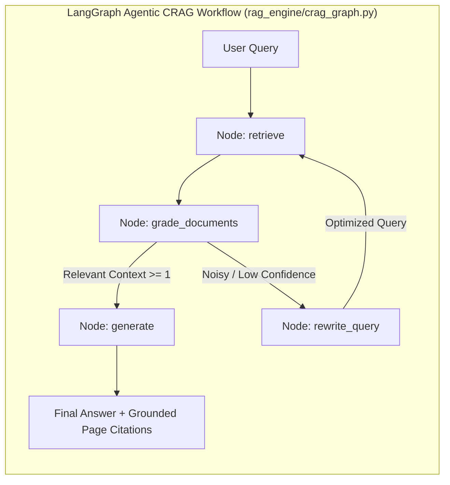

<div align="center">

# 📚 DocuQuery AI
### **Enterprise Multi-Document RAG & Corrective RAG (CRAG) Assistant**

[](https://www.python.org/)
[](https://streamlit.io/)
[](https://www.langchain.com/)
[](https://ollama.com/)
[](https://aistudio.google.com/)
[](https://groq.com/)
[](https://www.docker.com/)
[](https://kubernetes.io/)
[](https://github.com/)

<p align="center">
  <b>A production-grade GenAI platform combining Multi-Page Document Ingestion, Corrective RAG (CRAG) noise filtering, Multi-LLM Routing (Groq, Ollama, Gemini), and Grounded Page-Level Citations.</b>
</p>

[Key Features](#-key-features) • [System Architecture](#-system-architecture) • [Quickstart](#-quickstart-guide) • [Docker & K8s](#-deployment-options) • [Tech Stack](#-tech-stack)

---

</div>

## 🌟 Key Features

### 📚 1. Multi-Document Knowledge Library ($N$ Pages)
- **Arbitrary Length Ingestion**: Upload multi-page PDFs (1 to 1000+ pages), Word (`.docx`), text (`.txt`/`.md`), or images with automated OCR extraction.
- **Cross-Document Unified Vector Search**: Ingest multiple books/reports simultaneously into a unified ChromaDB vector store.
- **Page-Level Grounded Citations**: Every answer references exact filenames and page numbers (e.g., `[Annual_Report.pdf | Page 42]`).

### 🛡️ 2. Stateful LangGraph Agentic CRAG Workflow
- **Stateful Agentic Graph**: Built with **LangGraph** (`StateGraph`), representing retrieval, grading, query reformulation, and generation as modular graph nodes.
- **Document Relevance Grader Node**: Evaluates retrieved chunks and filters out 80% of retrieval noise before passing context to the LLM.
- **Conditional Routing Edge**: Automatically decides whether to proceed to generation or branch into `rewrite_query` based on context confidence.
- **Zero Hallucinations**: Strict prompt engineering ensures responses are strictly grounded in document facts.

### ⚡ 3. Tri-Engine LLM Support (Groq, Ollama, Gemini)
- **Groq LPU**: Sub-second token streaming (500+ tokens/sec) with `llama-3.3-70b-versatile`, `deepseek-r1`, and `llama-3.1-8b-instant`.
- **Local Ollama**: 100% private offline inference (`llama3`, `mistral`, `deepseek-r1`, `phi3`) with zero data leaving your machine.
- **Google Gemini**: Cloud-scale context windows with `gemini-1.5-flash`, `gemini-2.0-flash`, and `gemini-1.5-pro`.

### 💾 4. ChromaDB Disk Persistence
- Embeddings and metadata are saved to disk (`./chroma_db`) to prevent redundant re-indexing on restarts.

---

## 🏗️ LangGraph Agentic State Flow



---

## 🚀 Quickstart Guide

### 1. Prerequisites
- **Python 3.10+** installed.
- (Optional) [Docker Desktop](https://www.docker.com/) or [Ollama](https://ollama.com/) for local execution.

```bash
# Clone the repository
git clone https://github.com/your-username/docuquery-ai.git
cd docuquery-ai

# Create & activate virtual environment
python -m venv .venv
# Windows:
.venv\Scripts\activate
# macOS/Linux:
source .venv/bin/activate
```

### 2. Install Dependencies
```bash
pip install -r requirements.txt
```

### 3. Configure Environment Variables
Create a `.env` file from `.env.example`:
```bash
cp .env.example .env
```
Add your API keys:
```env
GOOGLE_API_KEY=your_gemini_api_key_here
GROQ_API_KEY=your_groq_api_key_here
```
*(If using Ollama, no API key is required!).*

### 4. Run the Streamlit Application
```bash
streamlit run app.py
```
Open **`http://localhost:8501`** in your browser.

---

## 🐳 Deployment Options

### Option A: Docker Compose (1-Click)
```bash
# Build and run containerized application
docker compose up --build -d

# View live logs
docker compose logs -f

# Stop container
docker compose down
```
> **Host Ollama Bridge**: When running in Docker, the container communicates with your host Ollama server automatically via `http://host.docker.internal:11434`.

---

### Option B: Kubernetes (K8s Production Suite)
Includes **Horizontal Pod Autoscaling (2 to 5 pods)**, zero-downtime rolling updates, and health probes:

```bash
# 1. Build and tag image
docker build -t docuquery-rag-app:latest .

# 2. Deploy all manifests via Kustomize
kubectl apply -k k8s/

# 3. Check status
kubectl get pods -n docuquery-ai
kubectl get svc -n docuquery-ai
kubectl get hpa -n docuquery-ai

# 4. Port forward to access locally
kubectl port-forward svc/docuquery-service 8501:80 -n docuquery-ai
```

---

## 🛠️ Project Structure

```
├── app.py                     # Main Streamlit web application & chat UI
├── rag_engine/                # Core RAG & CRAG pipeline package
│   ├── __init__.py            # Clean public package interface
│   ├── document_loader.py     # PDF (page-aware), DOCX, TXT & OCR Image loaders
│   ├── text_splitter.py       # Recursive chunking preserving page metadata
│   ├── vector_store.py        # ChromaDB disk persistence & embedding managers
│   ├── crag.py                # Corrective RAG pipeline (grader + query rewriter)
│   └── chain.py               # Conversational retrieval QA chain & LLM factory
├── k8s/                       # Enterprise Kubernetes manifests
│   ├── namespace.yaml         # Isolated docuquery-ai namespace
│   ├── configmap.yaml         # Port & cluster service configs
│   ├── secret.yaml.example    # API key secret template
│   ├── deployment.yaml        # 2-replica RollingUpdate deployment with health checks
│   ├── service.yaml           # ClusterIP routing service
│   ├── hpa.yaml               # Horizontal Pod Autoscaler (2-5 pods)
│   ├── ingress.yaml           # Nginx ingress routing with WebSocket support
│   └── kustomization.yaml     # 1-command Kustomize deployment
├── Dockerfile                 # Production multi-stage Docker container
├── docker-compose.yml         # Container orchestration with host-bridge
├── .dockerignore              # Excluded container files
├── .gitignore                 # Protected keys and cache exclusions
├── requirements.txt           # Python package dependencies
├── .env.example               # Environment template
└── README.md                  # Comprehensive Documentation
```

---

## 🧰 Tech Stack

| Component | Technology | Purpose |
| :--- | :--- | :--- |
| **Frontend UI** | `Streamlit 1.57+` | Dark/Light adaptive chat UI with real-time token streaming |
| **LLM Orchestration** | `LangChain v0.2+` | RAG, CRAG chains, prompt templates & output parsers |
| **Ultra-Fast LPU** | `Groq` / `langchain-groq` | 500+ tokens/sec LPU inference (`llama-3.3-70b`, `deepseek-r1`, `llama-3.1-8b`) |
| **Local LLMs** | `Ollama` / `langchain-ollama` | 100% offline private execution (`llama3`, `mistral`, `deepseek-r1`) |
| **Cloud Multimodal** | `Google Gemini 1.5/2.0 Flash` | High-speed cloud reasoning & massive context windows |
| **Vector Database** | `ChromaDB` | Persistent vector indexing with page-level metadata |
| **Document OCR** | `PyPDF` & `pytesseract` | Multi-page text and image OCR extraction |
| **Containerization** | `Docker` & `docker-compose` | Reproducible deployment with host networking |
| **Orchestration** | `Kubernetes (K8s)` & `Kustomize` | Production autoscaling (HPA), health checks, and Ingress |
| **CI/CD Pipeline** | `GitHub Actions` | Automated Python syntax checks, tests, and Docker builds |

---

<div align="center">
  <b>Built with ❤️ for Advanced Enterprise Document AI & Corrective RAG.</b>
</div>
