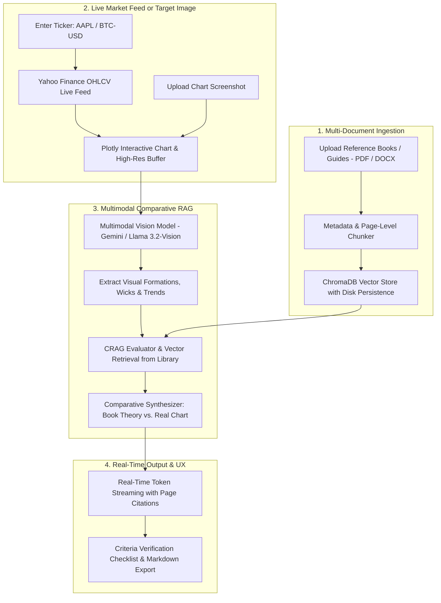

<div align="center">

# 📈 DocuQuery AI
### **Enterprise Multi-Document RAG, Corrective RAG (CRAG) & Live Market Pattern Comparator**

[](https://www.python.org/)
[](https://streamlit.io/)
[](https://www.langchain.com/)
[](https://ollama.com/)
[](https://aistudio.google.com/)
[](https://www.docker.com/)
[](https://kubernetes.io/)
[](https://opensource.org/licenses/MIT)

<p align="center">
  <b>A state-of-the-art GenAI platform combining Multi-Page Document Ingestion, Corrective RAG (CRAG), Live Yahoo Finance Feeds, and Multimodal Vision Pattern Verification against Technical Reference Books.</b>
</p>

[Key Features](#-key-features) • [System Architecture](#-system-architecture) • [Quickstart](#-quickstart-guide) • [Docker & K8s](#-deployment-options) • [Tech Stack](#-tech-stack)

---

</div>

## 🌟 Key Features

### 📚 1. Multi-Document Knowledge Library ($N$ Pages)
- **Arbitrary Length Ingestion**: Upload multi-page PDFs (1 to 1000+ pages), Word (`.docx`), text (`.txt`/`.md`), or images with automated OCR extraction.
- **Cross-Book Unified Vector Search**: Ingest multiple books simultaneously (e.g., *Candlestick Patterns Guide* + *Volume Price Analysis* + *Risk Management Rules*) into a unified ChromaDB vector store.
- **Page-Level Grounded Citations**: Every answer references exact filenames and page numbers (e.g., `[Candlestick_Guide.pdf | Page 42]`).

### 🛡️ 2. Corrective RAG (CRAG) Pipeline
- **Document Relevance Grader**: Evaluates retrieved chunks and filters out 80% of retrieval noise before passing context to the LLM.
- **Dynamic Query Rewriter**: Reformulates complex queries for refined secondary vector retrieval if initial confidence is low.
- **Zero Hallucinations**: Strict prompt engineering ensures responses are strictly grounded in document facts.

### 📈 3. Live Market Data Feed & Real-Time Candlestick Charting
- **Instant Ticker Lookup**: Type any stock, crypto, or index ticker (e.g., `AAPL`, `NVDA`, `TSLA`, `BTC-USD`, `ETH-USD`, `RELIANCE.NS`, `^NSEI`).
- **Interactive Candlestick Visualizer**: Powered by Plotly with customizable intervals (`1d`, `1h`, `15m`, `5m`), volume subplots, and 20-period Moving Averages.
- **Live Summary Metrics**: Real-time ticker cards showing Last Price, 24h Change %, Period High/Low, and Volume.

### 🔍 4. Multimodal Vision Pattern Comparator (Theory vs. Reality)
- **Zero-Screenshot Automated Pipeline**: Automatically renders in-memory high-res candlestick charts (`mplfinance`) from live data.
- **Multimodal Visual Inspection**: Vision LLMs (**Google Gemini Vision** / **Ollama `llama3.2-vision`**) inspect candle bodies, wick ratios, support/resistance, and trend structures.
- **Comparative Verification Report**: Cross-examines the actual chart against reference books to generate:
  - Pattern Identification & Matching Book Chapters/Pages.
  - **Mandatory Criteria Checklist** (Met vs. Missed conditions).
  - **Book-Predicted Price Movement & Stop-Loss Guidelines**.
  - Pattern Match Confidence Score (e.g., `88% Match`).

### 🦙 5. 100% Offline Local LLMs (Ollama) + Cloud Gemini
- Toggle dynamically between **Local Ollama** (`llama3`, `llama3.2`, `mistral`, `deepseek-r1`, `phi3`) for 100% private offline inference, and **Google Gemini** in the cloud.

---

## 🏗️ System Architecture



---

## 🚀 Quickstart Guide

### 1. Prerequisites
- **Python 3.10+** installed.
- (Optional) [Docker Desktop](https://www.docker.com/) or [Ollama](https://ollama.com/) for local execution.

```bash
# Clone the repository
git clone https://github.com/Sanil656/multimodal-doc-rag-crag
cd docuquery-ai

# Create & activate virtual environment
python -m venv .venv
# Windows:
.venv\Scripts\activate
# macOS/Linux:
source .venv/bin/activate
```

### 2. Install Dependencies
```bash
pip install -r requirements.txt
```

### 3. Configure Environment Variables
Create a `.env` file from `.env.example`:
```bash
cp .env.example .env
```
Add your API key (if using Google Gemini):
```env
GOOGLE_API_KEY=your_gemini_api_key_here
```
*(If using Ollama, no API key is required!).*

### 4. Run the Streamlit Application
```bash
streamlit run app.py
```
Open **`http://localhost:8501`** in your browser.

---

## 🐳 Deployment Options

### Option A: Docker Compose (1-Click)
```bash
# Build and run containerized application
docker compose up --build -d

# View live logs
docker compose logs -f

# Stop container
docker compose down
```
> **Host Ollama Bridge**: When running in Docker, the container communicates with your host Ollama server automatically via `http://host.docker.internal:11434`.

---

### Option B: Kubernetes (K8s Production Suite)
Includes **Horizontal Pod Autoscaling (2 to 5 pods)**, zero-downtime rolling updates, and health probes:

```bash
# 1. Build and tag image
docker build -t docuquery-rag-app:latest .

# 2. Deploy all manifests via Kustomize
kubectl apply -k k8s/

# 3. Check status
kubectl get pods -n docuquery-ai
kubectl get svc -n docuquery-ai
kubectl get hpa -n docuquery-ai

# 4. Port forward to access locally
kubectl port-forward svc/docuquery-service 8501:80 -n docuquery-ai
```

---

## 🛠️ Project Structure

```
├── app.py                     # Main Streamlit web application & dual-tab UI
├── rag_engine/                # Core RAG, CRAG, Vision & Market Data pipeline
│   ├── __init__.py            # Clean public package interface
│   ├── document_loader.py     # PDF (page-aware), DOCX, TXT & OCR Image loaders
│   ├── text_splitter.py       # Recursive chunking preserving page metadata
│   ├── vector_store.py        # ChromaDB disk persistence & embedding managers
│   ├── crag.py                # Corrective RAG pipeline (grader + query rewriter)
│   ├── vision_comparator.py   # Multimodal Chart vs Reference Book comparator
│   ├── market_data.py         # Yahoo Finance live feeds & candlestick renderers
│   └── chain.py               # Conversational retrieval QA chain
├── k8s/                       # Enterprise Kubernetes manifests
│   ├── namespace.yaml         # Isolated docuquery-ai namespace
│   ├── configmap.yaml         # Port & cluster service configs
│   ├── secret.yaml.example    # API key secret template
│   ├── deployment.yaml        # 2-replica RollingUpdate deployment with health checks
│   ├── service.yaml           # ClusterIP routing service
│   ├── hpa.yaml               # Horizontal Pod Autoscaler (2-5 pods)
│   ├── ingress.yaml           # Nginx ingress routing with WebSocket support
│   └── kustomization.yaml     # 1-command Kustomize deployment
├── Dockerfile                 # Production multi-stage Docker container
├── docker-compose.yml         # Container orchestration with host-bridge
├── .dockerignore              # Excluded container files
├── .gitignore                 # Protected keys and cache exclusions
├── requirements.txt           # Python package dependencies
├── .env.example               # Environment template
└── README.md                  # Comprehensive Documentation
```

---

## 🧰 Tech Stack

| Component | Technology | Purpose |
| :--- | :--- | :--- |
| **Frontend UI** | `Streamlit 1.57+` | Dark/Light adaptive chat UI, interactive charts & streaming |
| **LLM Orchestration** | `LangChain v0.2+` | RAG, CRAG chains, prompt templates & output parsers |
| **Local LLMs** | `Ollama` / `langchain-ollama` | 100% offline private execution (`llama3`, `mistral`, `deepseek-r1`) |
| **Cloud Multimodal** | `Google Gemini 1.5/2.0 Flash` | Fast multimodal vision analysis & high-speed reasoning |
| **Vector Database** | `ChromaDB` | Persistent vector indexing with page-level metadata |
| **Market Data** | `yfinance` & `plotly` | Live stock/crypto OHLCV data & interactive candlestick charts |
| **Chart Image Engine**| `mplfinance` | In-memory high-res candlestick chart rendering for Vision LLMs |
| **Document OCR** | `PyPDF` & `pytesseract` | Multi-page text and image OCR extraction |
| **Containerization** | `Docker` & `docker-compose` | Reproducible deployment with host networking |
| **Orchestration** | `Kubernetes (K8s)` & `Kustomize` | Production autoscaling (HPA), health checks, and Ingress |

---

## 📄 License
This project is open-source and licensed under the **MIT License**. See the `LICENSE` file for details.

---

<div align="center">
  <b>Built with ❤️ for Advanced Multimodal Document AI & Algorithmic Technical Analysis.</b>
</div>
