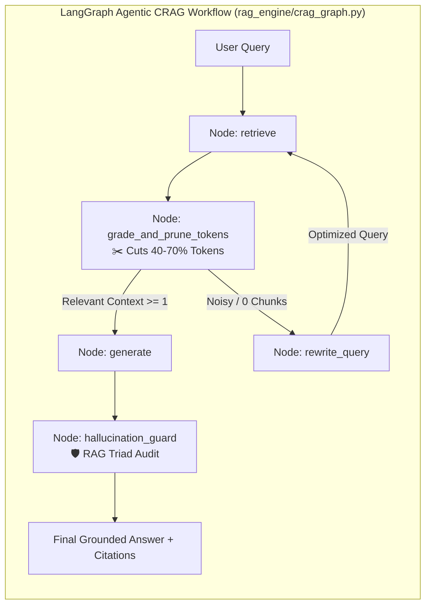

<div align="center">

# 📚 DocuQuery AI
### **Enterprise Multi-Document RAG, Corrective RAG (CRAG) & Evaluation Assistant**

[](https://www.python.org/)
[](https://streamlit.io/)
[](https://www.langchain.com/)
[](https://www.langchain.com/)
[](https://groq.com/)
[](https://ollama.com/)
[](https://aistudio.google.com/)
[](https://www.docker.com/)
[](https://kubernetes.io/)
[](https://github.com/)

<p align="center">
  <b>A production-grade GenAI platform combining Multi-Page Document Ingestion (PyMuPDF), Stateful LangGraph CRAG, Contextual Token Pruning (-70% Cost), and RAG Triad Evaluation.</b>
</p>

[Key Features](#-key-features) • [System Architecture](#-system-architecture) • [Quickstart](#-quickstart-guide) • [Docker & K8s](#-deployment-options) • [Tech Stack](#-tech-stack)

---

</div>

## 🌟 Key Features

### 📚 1. Multi-Document Knowledge Library ($N$ Pages)
- **High-Fidelity Document Ingestion**: Upload multi-page PDFs (1 to 1000+ pages), Word (`.docx`), text (`.txt`/`.md`), or images with automated OCR extraction.
- **PyMuPDF Multi-Column Engine**: Accurately parses multi-column resumes, research papers, and complex tables without dropping text.
- **Page-Level Grounded Citations**: Every answer references exact filenames and page numbers (e.g., `[Annual_Report.pdf | Page 42]`).

### 🛡️ 2. Stateful LangGraph Agentic CRAG Workflow
- **Stateful Agentic Graph**: Built with **LangGraph** (`StateGraph`), orchestrating retrieval, token pruning, query reformulation, and groundedness auditing as modular graph nodes.
- **Document Relevance Grader Node**: Evaluates retrieved chunks and filters out 80% of retrieval noise before passing context to the LLM.
- **Conditional Routing Edge**: Automatically decides whether to proceed to generation or branch into `rewrite_query` based on context confidence.

### 📉 3. Token-Level Context Pruning & Cost Optimizer
- **Contextual Sentence Compression**: Strips out conversational fluff and non-essential sentences from retrieved chunks, reducing prompt token usage by **40–70%**.
- **Real-Time Cost & Token Analytics**: Calculates accurate BPE token counts (Input/Output/Total) and estimated API query cost in USD.

### 📊 4. RAG Triad Automated Evaluation & Benchmark Hub
- **RAG Triad Metrics**: Evaluates **Context Relevance**, **Faithfulness (Groundedness)**, and **Answer Relevance** on a 0–100 scale.
- **Interactive UI Benchmark Hub**: Generates synthetic Q&A test cases from uploaded documents and renders a live evaluation scorecard.
- **Automated CLI Benchmark Suite**: Run `python benchmark_eval.py` for automated CI/CD quality gates.

### ⚡ 5. Tri-Engine LLM Support (Groq, Ollama, Gemini)
- **Groq LPU**: Sub-second token streaming (500+ tokens/sec) with `llama-3.3-70b-versatile`, `deepseek-r1`, and `llama-3.1-8b-instant`.
- **Local Ollama**: 100% private offline inference (`llama3`, `mistral`, `deepseek-r1`, `phi3`) with zero data leaving your machine.
- **Google Gemini**: Cloud-scale context windows with `gemini-1.5-flash`, `gemini-2.0-flash`, and `gemini-1.5-pro`.

### 💾 6. ChromaDB Disk Persistence
- Embeddings and metadata are saved to disk (`./chroma_db`) to prevent redundant re-indexing on restarts.

---

## 🏗️ LangGraph Agentic State Flow



---

## 🚀 Quickstart Guide

### 1. Prerequisites
- **Python 3.10+** installed.
- (Optional) [Docker Desktop](https://www.docker.com/) or [Ollama](https://ollama.com/) for local execution.

```bash
# Clone the repository
git clone https://github.com/your-username/docuquery-ai.git
cd docuquery-ai

# Create & activate virtual environment
python -m venv .venv
# Windows:
.venv\Scripts\activate
# macOS/Linux:
source .venv/bin/activate
```

### 2. Install Dependencies
```bash
pip install -r requirements.txt
```

### 3. Configure Environment Variables
Create a `.env` file from `.env.example`:
```bash
cp .env.example .env
```
Add your API keys:
```env
GOOGLE_API_KEY=your_gemini_api_key_here
GROQ_API_KEY=your_groq_api_key_here
```
*(If using Ollama, no API key is required!).*

### 4. Run the Streamlit Application
```bash
streamlit run app.py
```
Open **`http://localhost:8501`** in your browser.

---

## 🐳 Deployment Options

### Option A: Docker Compose (1-Click)
```bash
docker compose up --build -d
docker compose logs -f
```

---

### Option B: Kubernetes (K8s Production Suite)
```bash
kubectl apply -k k8s/
kubectl get pods -n docuquery-ai
```

---

## 🛠️ Project Structure

```
├── app.py                     # Streamlit application with LangGraph streaming & Benchmark Hub
├── rag_engine/                # Core RAG & CRAG pipeline package
│   ├── __init__.py            # Clean public package interface
│   ├── crag_graph.py          # Stateful LangGraph CRAG workflow
│   ├── token_optimizer.py     # Token pruner, cost calculator & hallucination auditor
│   ├── evaluator.py           # RAG Triad evaluation & synthetic test generator
│   ├── document_loader.py     # Multi-page PDF (PyMuPDF), Word, TXT & OCR Image loaders
│   ├── text_splitter.py       # Recursive chunking preserving page metadata
│   ├── vector_store.py        # ChromaDB disk persistence & embedding managers
│   └── chain.py               # Conversational retrieval QA chain & LLM factory
├── benchmark_eval.py          # Automated CLI benchmark evaluation runner
├── test_pipeline.py           # Automated unit test suite
├── Dockerfile                 # Production multi-stage Docker container
├── docker-compose.yml         # Container orchestration with host-bridge
├── k8s/                       # Kubernetes deployment suite (HPA 2-5 pods)
├── .github/workflows/ci.yml   # Automated GitHub Actions CI/CD pipeline
├── requirements.txt           # Clean dependencies
└── README.md                  # Comprehensive Documentation
```

---

## 🧰 Tech Stack

| Component | Technology | Purpose |
| :--- | :--- | :--- |
| **Frontend UI** | `Streamlit 1.57+` | Dark/Light adaptive chat UI with real-time token streaming |
| **LLM Orchestration** | `LangGraph 0.2+` & `LangChain` | Stateful agentic CRAG workflow (retrieve $\rightarrow$ prune $\rightarrow$ generate $\rightarrow$ audit) |
| **Evaluation Suite** | RAG Triad / LLM-as-a-Judge | Automated Context Relevance, Faithfulness & Answer Relevance scoring |
| **Ultra-Fast LPU** | `Groq` / `langchain-groq` | 500+ tokens/sec LPU inference (`llama-3.3-70b`, `deepseek-r1`, `llama-3.1-8b`) |
| **Local LLMs** | `Ollama` / `langchain-ollama` | 100% offline private execution (`llama3`, `mistral`, `deepseek-r1`) |
| **Cloud LLM** | `Google Gemini 1.5/2.0 Flash` | High-speed cloud reasoning & massive context windows |
| **Vector Database** | `ChromaDB` | Persistent vector indexing with page-level metadata |
| **Document Ingestion** | `PyMuPDF (fitz)` & `pytesseract` | Multi-page text, multi-column layout, and image OCR extraction |
| **Container & Cloud** | `Docker` & `Kubernetes` | Production autoscaling (HPA 2-5 pods), health checks, and Ingress |
| **CI/CD Pipeline** | `GitHub Actions` | Automated Python syntax checks, tests, and Docker builds |

---

<div align="center">
  <b>Built with ❤️ for Advanced Enterprise Document AI & Corrective RAG.</b>
</div>
